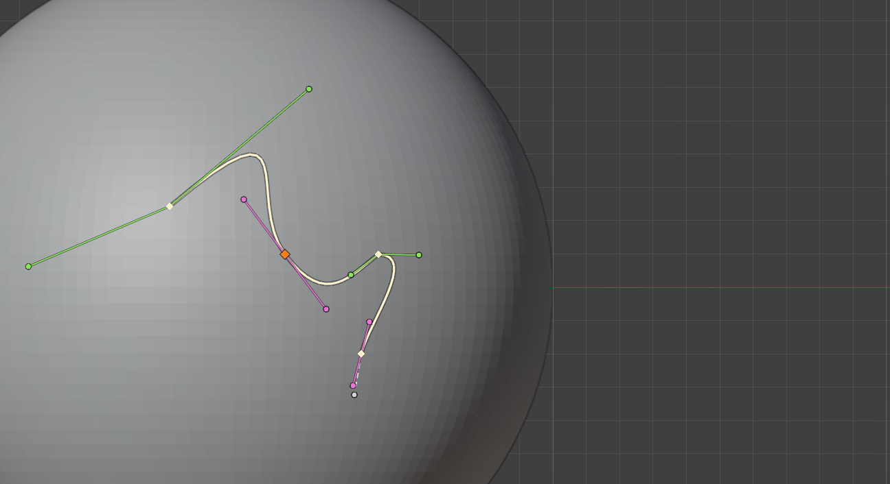
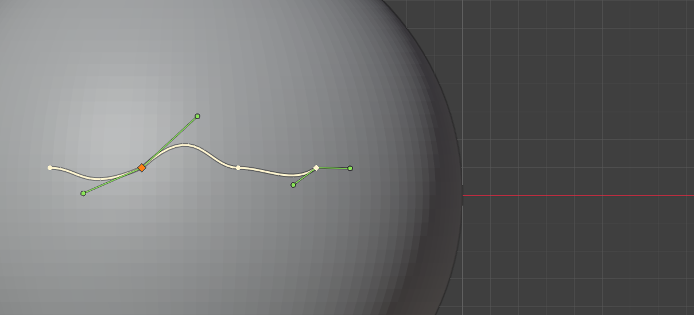
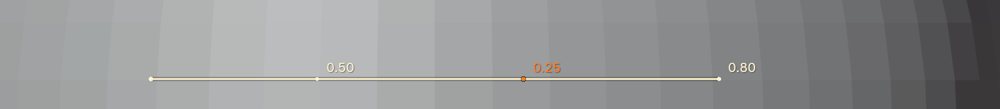

.. _drawing_curves:

#####################################
Drawing and Editing Curves
#####################################

Surface curves are drawn and edited with the same keys as Blender's own
`2D paint curves <https://docs.blender.org/manual/en/latest/sculpt_paint/brush/stroke.html>`_, but their
points sit on the mesh, so you can turn the view and keep working on the far side of a form.

.. note::

    The mouse buttons below are for Blender's default *Select with Left* setting.
    If you select with the right mouse button, left and right swap, as they do for Blender's own paint curves.
    See :ref:`keyboard_shortcuts` for the full list.

----------------------------------------------------------------------

---------------------------------
Adding Points
---------------------------------

**Ctrl+right-click** on the mesh to add a point:

* Away from the curve, the point is added to whichever **end** of the active curve is nearer the mouse.
* On the curve itself, the point is **inserted** there.
* With no active curve, a new curve is started.

Hold **Ctrl** before clicking to preview where the point will go: a dashed line runs from the end that will be extended,
or a dot marks where the point will be inserted.

**Ctrl+right-drag** adds a point and pulls out its :ref:`Bézier handles<bezier_handles>` in one go,
in the direction you are drawing. Starting the drag on an existing point pulls handles out of that point instead,
and starting on a handle drags the handle.

New points take the **Initial Point Type** set in the Stroke panel (see :ref:`point_types`).

----------------------------------------------------------------------

.. _selecting:

---------------------------------
Selecting
---------------------------------

* **Left-click** a point to select it, **Shift+left-click** to add or remove points. Clicking a handle selects its point.
* **Left-click** another curve's line to make it the active curve; **Shift+left-click** a curve's line to add it to (or remove it from) the selected curves.
* **Left-click** empty space to deselect everything. The active curve stays active.
* **A** selects or deselects all the points of the active curve.

As with Blender's paint curves, left-click only selects; moving is done with the right mouse button or G.

----------------------------------------------------------------------

---------------------------------
Moving Points
---------------------------------

* **Right-drag** a point (or a handle) to move it over the surface. **Shift+right-drag** adds the point to the selection first.
* **G**, **R** and **S** move, rotate and scale the selected points, keeping them on the surface.
  Left-click or Enter to confirm, right-click or Esc to cancel.

----------------------------------------------------------------------

.. _point_types:

---------------------------------
Point Types
---------------------------------

Each point is one of three types, shown by its shape:

.. list-table::
   :widths: 20 80
   :header-rows: 0

   * - **Smooth** (round)
     - The curve flows through the point. Its handles are worked out from the neighbouring points, so the point is all you place.
   * - **Sharp** (square)
     - A corner.
   * - **Bézier** (diamond)
     - The curve's direction and bend at the point are set by handles you drag.

**V** cycles the selected points through *Smooth → Sharp → Bézier*. If the selected points are of different types,
they all take the type after the first one's. A point turned into a Bézier point starts with the handles it had as a smooth point,
so the curve keeps its shape.

**Initial Point Type** in the Stroke panel sets the type new points are given.

----------------------------------------------------------------------

.. _bezier_handles:

---------------------------------
Bézier Handles
---------------------------------

A Bézier point's handles lie flat across the surface, at right angles to it, as in Substance Painter's path tool.

* **Right-drag** a handle to change the curve's direction and bend at the point.
* **Aligned** handles (pink) stay opposite each other: dragging one turns the other with it.
* Hold **Alt** while dragging (from the start, or part-way through) to **break** an aligned pair so the handles move
  independently (green). Alt-drag a broken pair to **re-align** it.
* Hold **Ctrl** while dragging to scale both handles together.

Handles follow their point: they turn with the surface when the point is moved, and rotate and scale with G, R and S.

----------------------------------------------------------------------

.. _point_pressure:

---------------------------------
Point Pressure
---------------------------------

Each point has a pressure from 0 to 1 (1 by default), for tapered strokes. Pressure fades evenly from one point to the next.

Press **Alt+S** and move the mouse in or out to set the pressure of the selected points; left-click to confirm or right-click to cancel.
Points are drawn smaller for less pressure, and their value is shown beside them when it is below 1:

The point pressure is multiplied by the **Pressure** setting in the Stroke panel.

.. note::

    Pressure only changes a stroke if the brush uses it: turn on pressure for the brush's *Strength* or *Size*
    (the pen icons beside them) to see a taper.

----------------------------------------------------------------------

---------------------------------
Deleting Points
---------------------------------

**X** or **Delete** deletes the selected points. Deleting every point of a curve removes the curve.

----------------------------------------------------------------------

.. _curve_list:

---------------------------------
The Curve List
---------------------------------

The Stroke panel lists the mesh's curves:

* The **active** curve (highlighted) is the one you add points to and edit.
* **Ticked** curves are the ones a stroke runs along. If none are ticked, the active curve is used.
* The **eye** hides a curve: a hidden curve isn't drawn, can't be clicked or edited, and isn't stroked.
* **+** starts a new, empty curve; **−** deletes the ticked curves (or the active one).
  The tick buttons below them tick or untick every curve.
* Double-click a name to rename it.

----------------------------------------------------------------------

.. _undo:

---------------------------------
Undo
---------------------------------

**Ctrl+Z** undoes curve edits and strokes together, in the order you made them; **Ctrl+Shift+Z** (or **Ctrl+Y**) redoes.

Surface curves are otherwise kept out of Blender's undo, so undoing a stroke leaves your curves as they are, ready to stroke again.
Selecting, ticking and hiding curves are not undo steps.
