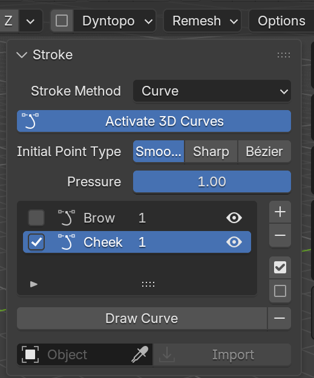

.. _importing_curves:

#####################################
Importing Curve Objects
#####################################

.. TODO: a GIF of a curve object imported onto a mesh and stroked.

Any Blender curve object can be brought onto the mesh as surface curves, to draw a path with Blender's curve tools
(or reuse one you already have) and then stroke along it.

In the Stroke panel, pick the curve object in the field at the bottom and click **Import**:

Each spline in the curve object becomes a surface curve, named after the object, and each of its points is moved onto the
nearest point of the mesh's surface. The imported curves are ticked, ready to stroke, and **Ctrl+Z** undoes the import.

The curve object itself is left as it is, and isn't linked to the imported curves: edit it and import it again to bring in the changes.

---------------------------------
How Points Are Brought Across
---------------------------------

.. list-table::
   :widths: 40 60
   :header-rows: 1

   * - In the curve object
     - On the surface
   * - Bézier point, *Auto* handles
     - :ref:`Smooth<point_types>` point
   * - Bézier point, *Vector* handles
     - :ref:`Sharp<point_types>` point
   * - Bézier point, *Aligned* or *Free* handles (or a mix)
     - :ref:`Bézier<point_types>` point with the same handles, laid flat across the surface; aligned unless a side is *Free* or *Vector*
   * - Poly spline points
     - Sharp points
   * - NURBS spline points
     - Smooth points through the control points (so the shape is close, but not exact)
   * - Radius
     - :ref:`Point pressure<point_pressure>`, up to 1
   * - Closed (cyclic) spline
     - An open curve that returns to its first point

.. tip::

    A curve object that lies close to the surface comes across most faithfully, since each point moves to the nearest point of the mesh.
    In the curve's Edit Mode, Blender's *Draw* tool with its *Depth* set to *Surface*, or snapping to the mesh's faces, are good ways to draw one.
