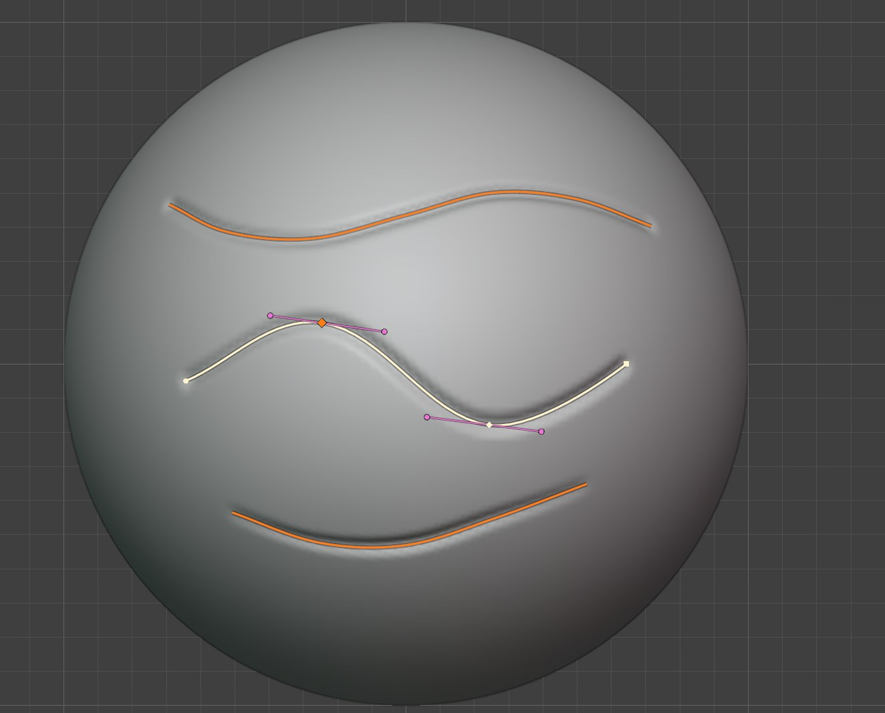

.. Curve Stroke documentation master file.

Curve Stroke
======================================

---------------------------------
What is Curve Stroke?
---------------------------------

Curve Stroke runs Blender's sculpt brushes along curves drawn on the surface of a mesh, in 3D.

Blender already has a *Curve* stroke method, but its curves are drawn flat on the screen: they only
follow the surface you can see from one view, and the stroke is projected from there. Curve Stroke
gives the same stroke method curves that lie *on* the mesh, so they wrap around forms, can be
edited from any angle, and are kept with the object for as long as you need them.

* :ref:`Draw curves on the surface<drawing_curves>` with the same keys as Blender's own 2D paint curves.
* :ref:`Shape them<point_types>` with smooth, sharp and Bézier points, and :ref:`taper them<point_pressure>` with per-point pressure.
* :ref:`Stroke any brush<stroking>` along them: Draw, Crease, Clay, Mask, Face Sets, colour painting and the rest.
* Keep as many curves as you like on each mesh, :ref:`hide<curve_list>` the ones you aren't using, and stroke several at once.
* :ref:`Import<importing_curves>` existing curve objects onto the surface.
* Strokes respect the brush's :ref:`Stroke settings<stroke_settings>` (spacing, dash, jitter), and work on :ref:`Multires<multires>` meshes.

Beware!
================

* Curve Stroke is an early release: please report any problems, slow downs or ideas to `info@configurate.net <mailto:info@configurate.net>`_.
* It needs Blender 5.2 or later.
* Strokes are run by Blender's own sculpt brushes, so they cost what a hand-drawn stroke of the same length would.

.. toctree::
   :maxdepth: 1
   :caption: Contents:

   installation
   quick_start
   drawing_curves
   stroking
   importing_curves
   keyboard_shortcuts
   troubleshooting
   contact
